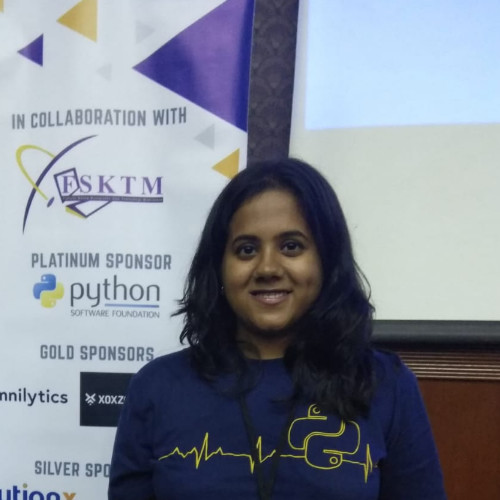

### **TinyML for Solar Panels: Bringing Edge Computing Applications to Solar Energy Systems w/ Archana Vaidheeswaran**
### **Time: 2:00-2:30PM PDT**

With the advent of IoT devices, it has become essential to utilize their data and run inference on the edge. TinyML is the use of Edge devices which can be used for running machine learning models at the edge. There are several advantages of using edge computing. The field of Solar Energy Systems holds immense potential for edge computing.   In this talk, we will cover three applications of edge computing. The first application is the Estimation of Power Loss of Solar Panels. Soiling on solar panels can cause more than 30% of power loss in PV system generations. There have been some attempts in utilizing deep learning in soiling detection and the corresponding power loss estimation. However, the proposed methods costly GPU, which is not economically suitable for detecting soiling in remote solar farms. To take care of both of the accuracy and cost, this work proposes a lite model that can be implemented on edge computing devices, such as Raspberry Pi, EdgeTPU, FPGA, and VPU The second application is the continuation of the first into the detection of soiling and its classification through an opensource dataset called PV Net. The last application is solar irradiance forecasting using sky images. Real-time irradiance measurements can be found through satellite or can be obtained from ground sky images.  With edge computing, we can do quicker solar irradiance forecasting; short term forecasting up to 1 min. The work will showcase the same.
  
Zoom Link: vmware.zoom.us/jsdkfslf 

    

Archana Vaidheeswaran is a Women Who Code fellow who has published works on neural networks and ML topics.

