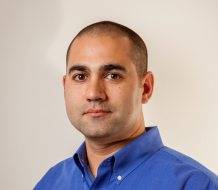

### <h2>Hackathon<h2>

<h3>It’s not a VMware {code} event if there isn’t a Hackathon! And this year will be no different. Our 5th annual Hackathon is right around the corner. On October 1 and 2nd, VMware {code} will be hosting a 2-day virtual, live, conference. You can read more about the conference here and register here.</h3>
 
Unlike past years, we unfortunately cannot be together in the same room for one of my favorite events so this year’s logistics will be a little different.
   
<b>Don’t know how to code? Don’t worry, there’s something to do on every team regardless of skill level!</b>
   

<h3>Captains:</h3>
 
This year, we’re recruiting captains for the Hackathon. A captain will be responsible for providing the team’s hackathon idea. Their idea will be added to our registration page (to open on Sept 7th) so that prospective participants can choose the captain whose idea & time zone suits their needs best! On Sept 20, Captains will be mailed the list of team members who signed up for their idea and it’s their responsibility to set up teams calls over the next few weeks. On October 2nd the captain or one of their team members will present their work to our judges who will score projects and award prizes! Interested or know someone interested? Please fill out <a href="URLHERE">this google form</a>!
  
<b>PLEASE NOTE: As a thank you for being a captain, we may or may not be sending a “thank you” gift to captains who sign up 😉</b>
  
<b>Key Dates:</b>
  
<ul>
  <li> September 7th- Hackathon Registration Opens </li>
  <li> September 20th- Captains are sent their teams </li>
  <li> September 21st- October 2nd- Teams work on their projects </li>
  <li> October 2nd- Project final presentations, judging and awards </li>
</ul> 

<h3>Judges:</h3>
 
<b>Michael Roy, Product Line Marketing Manager, VMware Inc.</b> 
Twitter handle: @mikeroySoft
   

In his own words, “By day I manage the VMware Fusion and Workstation product line, by night I am a cancan dancer.” Michael has been a part of the VMware family for over 10 years now and is Responsible for Product Management of VMware Desktop Hypervisor technology products including VMware Fusion, Workstation and Player. He focuses on developer productivity, Kubernetes, and cloud native application development.
   
 
 
 
 
  
  
<b>Justin Sider, Chief Information Officer, Belay Technologies</b> 
Twitter handle: @jpsider
   

Justin leads the development and implementation of a tool for his current company utilizing VMware, Google Cloud Platform, and Microsoft Azure for an automated provisioning & testing solution. He is a strong advocate for PowerShell and using it to automate as much as possible. Justin’s github repository and blog can be found here:
 https://github.com/jpsider?tab=repositories  
 https://invoke-automation.blog
 In his free time Justin loves to play golf and travel!

<h3>Summary:</h3>
In the words of Kyle Ruddy: Please join us for one of the most interesting extra-curricular events at VMworld, the fourth fifth annual VMware Code Hackathon! It doesn’t matter what your skill level is, there’s a team for you, just come excited to learn and connect! If you have any comments or questions, let us know in the comments or in the #vmworld-hackathon channel that’s part of the VMware Code Slack group.
  
<b>Make sure you’ve registered for CodeConnect, we hope to see you there!</b> 
