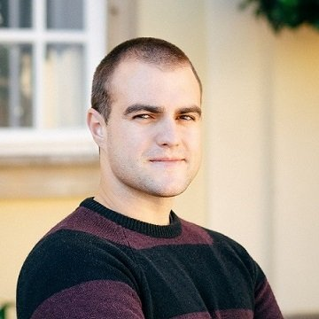

### **#100DaysOfCode challenge - building code skills and habits w/ Ivaylo Ivanov**
### **Time: 10:00-10:30AM PDT**

By the time of the Conference, I'll have completed my 100DaysOfCode challenge. I would like to share the idea behind, how to get started and what can one achieve during the challenge. One of the most important things to shape a new habit is persistence and consistency. The 100DaysOfCode, even if it sounds tough, aims to help you along the way.
 
Zoom Link: <a href="vmware.zoom.us/jsdkfslf">vmware.zoom.us/jsdkfslf</a>

    

Ivaylo Ivanov is a VMware engineer at Runecast Solutions. Ivaylo is currently focused on working with and learning in depth VMware products. His interests are mostly in system administration area, virtualization, automation and of course the thing that makes everything work together – networking. Ivaylor is a VMware Certified Professional (VCP-CMA, VCP-DCV, VCAP-DCA, VCAP-DCD, VCIX-DCV) and a vExpert 2016, 2017, 2018

