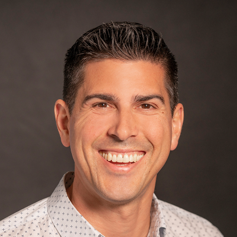

### **CodeCon Introduction & Keynote**
### **Time: 9:00-9:30AM PDT**

In the everchanging automation world, VMware has standardized the automation of Kubernetes by allowing you to automate like you always have. We're approaching Kubernetes from a vSphere automation perspective and embracing the merging of the two. At this keynote session, Kit Colbert will introduce our two-day live VMware {code} Connect conference and chat about the future of vSphere automation. Tune in for an exciting start to our conference! 

   
<a title="Add to Calendar" class="addeventatc" data-id="Nf5098547" href="https://www.addevent.com/event/Nf5098547" target="_blank" rel="nofollow">Add to Calendar</a>
        
  t

  

    

Kit Colbert is VP & CTO, Cloud Platform BU at VMware, driving technical strategy and innovation for VMware Cloud Foundation, vSphere, and VMware's hybrid cloud offerings. Previously he was GM of Cloud-Native Apps, CTO for End-User Computing, the Chief Architect and Principal Engineer for Horizon Workspace, and the lead Management Architect for the vRealize Operations Suite. At the start of his career, he was the technical lead behind the creation, development, and delivery of the vMotion and Storage vMotion features in vSphere. Kit holds a ScB in Computer Science from Brown University and is a recognized thought-leader on Cloud-Native, End-User Computing, and Hybrid Cloud Infrastructure trends. He speaks regularly at industry conferences, on the main stage at VMworld, and is the Hybrid Cloud voice for the VMware Office of the CTO blog.

