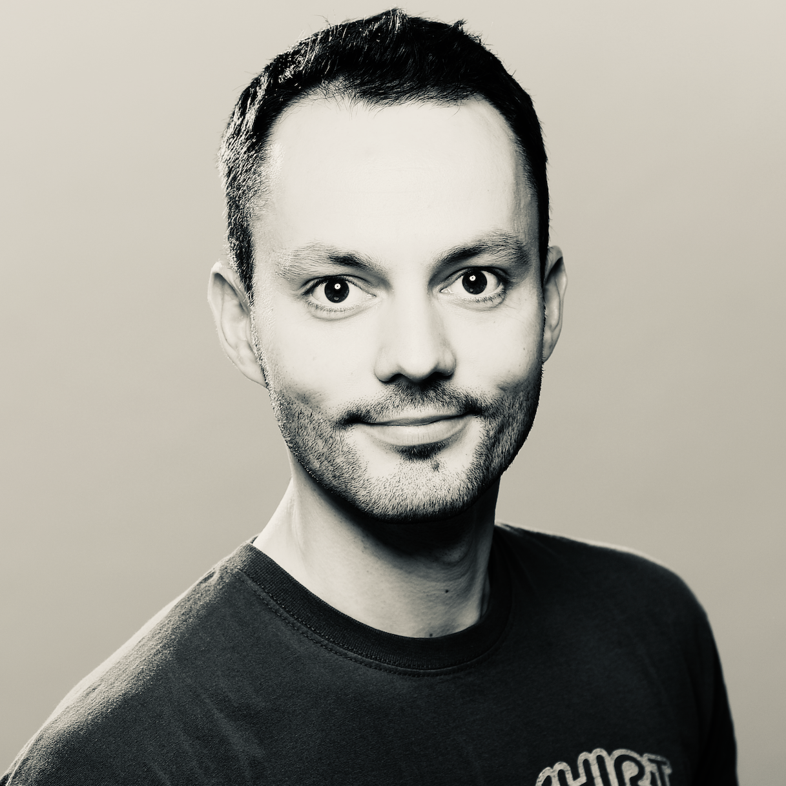

### **Let's build a Kubernetes Operator in Go! w/ Michael Gasch**
### **Time: 11:00AM-12:30PM PDT**

Kubernetes is quickly becoming the standard cloud API for deploying and managing modern workloads. 
Fundamentally, end-users express their desired state (application) state which is then reconciled by individual controllers in the platform. 
The beauty of this approach, besides its simplicity and robustness, is that it can be extended and used beyond the core Kubernetes types.
In fact, you can create your own APIs on top of Kubernetes for any resource by providing a custom controller logic to handle daily routine tasks or even complex lifecycle operations. 
This is also referred to as the ""operator pattern"". 

But how do you get started? What are the tools of the trade and basic primitives that you should understand before writing your first Kubernetes operator?
Even if you are not a (Go) developer, in this session we will walk you through the steps of creating your first operator from scratch by explaining the fundamentals of the Kubernetes platform
and applying our knowledge in a live coding session.
 
 
Zoom Link: vmware.zoom.us/jsdkfslf 

    

Meet our {code} coach Michael! Michael Gasch is a Staff Engineer in the Office of the CTO at VMware with a focus on event-driven systems, Kubernetes and service mesh. When asked what motivates him to do the work he does, Michael said, ” Growing up in communism (East Germany) before the wall came down I had to wait for my first computer (C64) until the age of 10. I was super curious and there was so much to learn but I never thought I was “smart” enough to learn a programming language like C or Java. So I doubled down on the “ops” side of IT (which is equally important of course). Many years later, when I heard about the Go programming language in the context of Kubernetes, I pushed myself to learn that language because the Kubernetes docs were missing/incomplete/outdated. Fast forward, I am a distributed systems engineer at VMware working on Service Mesh. This personal journey drives me to help everyone with a similar story and background to not be afraid and learn to code”.

