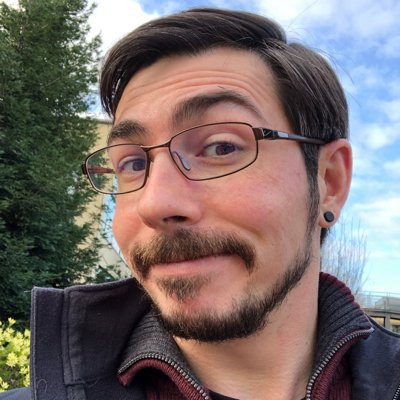

### **Local Kubernetes and Container development with Fusion and Workstation w/ Michael Roy**
### **Time: 12:30-1:00PM PDT**

Learn how new capabilities in Fusion and Workstation can deliver Containers and Kubernetes clusters on the Mac or Windows entirely without Docker. 
   
  <a title="Add to Calendar" class="addeventatc" data-id="MZ5085491" href="https://www.addevent.com/event/MZ5085491" target="_blank" rel="nofollow">Add to Calendar</a>
        

 

    

In his own words, “By day I manage the VMware Fusion and Workstation product line, by night I am a cancan dancer.” Michael has been a part of the VMware family for over 10 years now and is Responsible for Product Management of VMware Desktop Hypervisor technology products including VMware Fusion, Workstation and Player. He focuses on developer productivity, Kubernetes, and cloud native application development.

