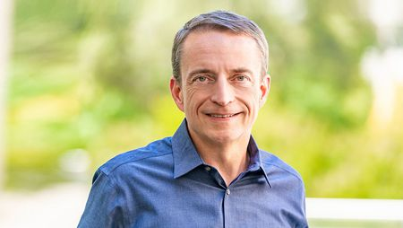

### **Day 2 Keynote w/ Pat Gelsinger**
### **Time: 9:00 - 9:30AM PDT**

To kick off our second and final day of {code} Connect, Pat will be chatting about the importance of the developer community and an overview of the nwe vSphere. He'll then open up the second half of his keynote to answer some Q&A from the audience. You don't want to miss this event! 
 
  
To kick off our second and final day of {code} Connect, Pat will be giving us an overview of the new vSphere and chatting about the importance of our developer community. He'll then open up the second half of his keynote to answer some Q&A from the audience. You don't want to miss this event! 
  

    

Pat Gelsinger has been serving as CEO of VMware since September 2012, doubling the size of the company during his tenure. He brings over 40 years of technology and leadership experience. Before joining VMware, Gelsinger led EMC's Information Infrastructure Products business as president and COO. A respected IT industry veteran, he was at Intel for 30 years becoming the company’s first CTO and driving the creation of key industry technologies including USB and Wi-Fi.

