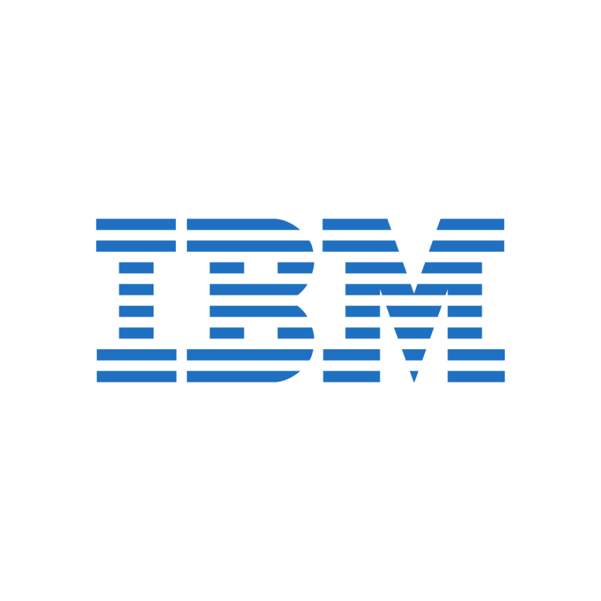
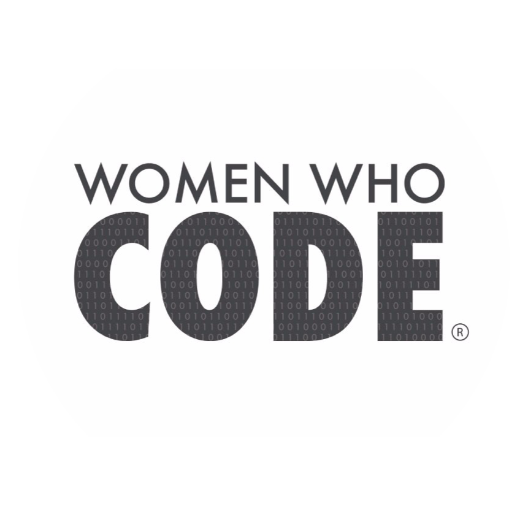

<link rel="icon" type="image/png" sizes="32x32" href="/favicon-32x32.png">

<!---->
Partners:

  

    
  

  

    
  

  

    
  

  

    
  

  

    
  

<table>
   <tr>
     <td><a href="#day1" width="33%">Day 1 Sessions</a></td>
     <td><a href="#day2" width="33%">Day 2 Sessions</a></td>
     <td><a href="#ScriptCompetition" width="33%">Script Competition</a></td>
     <td><a href="#hackathon" width="33%">Hackathon</a></td>
  </tr>
  <tr>
    <td colspan="4" width="100%">Tracks: <a href="#kubernetes">Kubernetes</a>, <a href="#automation">IT Automation</a>, <a href="#community">Community</a></td>
  </tr>
  </table>

	<h2><a href="calendar">Agenda at a Glance</a></h2>
	<h3 style="color:white">View our full calendar of sessions</h3> 

 

# Day 1 (10/1/20):

Session: CODE4100Time: 9:00-9:30AM PDT
   
<h3><a href="Kit">Keynote Session</a></h3>
<h4 style="color:white">Presenter: Kit Colbert, VP & CTO, Cloud Platform BU at VMware</h4>
In the everchanging automation world, VMware has standardized the automation of Kubernetes by... <a href="Kit">See More</a>
 
 
<a title="Add to Calendar" class="addeventatc" data-id="Nf5098547" href="https://www.addevent.com/event/Nf5098547" target="_blank" rel="nofollow">Add to Calendar</a>
	<i> &nbsp;&nbsp;Add to calendar to register for this session</i>

 

Session: CODE4101Time: 9:30-10:00AM PDT
   
<h3><a href="Wayne">Octant - An open source platform for building Kubernetes UIs</a></h3>
<h4 style="color:white">Presenter: Wayne Witzel III, Senior Member of Technical Staff at VMware</h4>
With so many different resources and custom resources within a Kubernetes cluster... <a href="Wayne">See More</a>
 
 
<a title="Add to Calendar" class="addeventatc" data-id="GS5085426" href="https://www.addevent.com/event/GS5085426" target="_blank" rel="nofollow">Add to Calendar</a>
	<i> &nbsp;&nbsp;Add to calendar to register for this session</i>

 

Session: CODE4102Time: 10:00-10:30AM PDT
   
<h3><a href="Sam">Automating Secrets with HashiCorp Vault and vRealize Automation</a></h3>
<h4 style="color:white">Presenter: <b>Sam McGeown</b>, Senior Technical Marketing Manager at VMware</h4>
Learn how to use HashiCorp Vault to manage secrets <a href="Sam">See More</a>
 
  
	<a title="Add to Calendar" class="addeventatc" data-id="by5085447" href="https://www.addevent.com/event/by5085447" target="_blank" rel="nofollow">Add to Calendar</a>
        <i> &nbsp;&nbsp;Add to calendar to register for this session</i>

 

Session: CODE4103Time: 10:30-11:00AM PDT
   
<h3><a href="Sajal">Monitoring K8s and TKGI in Modern Datacenter</a></h3>
<h4 style="color:white">Presenter: <b>Sajal Debnath</b>, Staff Architect at VMware</h4>
With the ever-increasing use of containerized applications, we see a significant proliferation of related technologies in modern datacenters...<a href="Sajal">See More</a>
 
  
	<a title="Add to Calendar" class="addeventatc" data-id="jA5085462" href="https://www.addevent.com/event/jA5085462" target="_blank" rel="nofollow">Add to Calendar</a>
        <i> &nbsp;&nbsp;Add to calendar to register for this session</i>

 

Session: CODE4104Time: 11:00AM-12:30PM PDT
   
<h3><a href="MichaelG">Let's build a Kubernetes Operator in Go!</a></h3>
<h4 style="color:white">Presenters: <b>Michael Gasch</b>, Staff Engineer at VMware & <b>Rafael Brito</b>, Application Platform Architect at VMware</h4>
Kubernetes is quickly becoming the standard cloud API for deploying and managing modern workloads...
<a href="MichaelG">See More</a>
 
  
	<a title="Add to Calendar" class="addeventatc" data-id="Yh5085465" href="https://www.addevent.com/event/Yh5085465" target="_blank" rel="nofollow">Add to Calendar</a>
        <i> &nbsp;&nbsp;Add to calendar to register for this session</i>

  

Session: CODE4105Time: 1:30PM-3:00PM PDT
   
<h3><a href="William">vSphere and VMware Cloud on AWS Automation Live Coding</a></h3>
<h4 style="color:white">Presenter: <b>William Lam</b>, Senior Staff Solution Architect at VMware</h4>
Do you work with vSphere or VMware Cloud AWS and wish to automate a particular task that you have not been able to figure out? ... <a href="William">See More</a>
 
  
<a title="Add to Calendar" class="addeventatc" data-id="Qv5085467" href="https://www.addevent.com/event/Qv5085467" target="_blank" rel="nofollow">Add to Calendar</a>
        <i> &nbsp;&nbsp;Add to calendar to register for this session</i>

 

 

## Script Competition
**Time: 3:30-5:00PM PDT**
 

Session: CODE4106Time: 3:00-5:00PM PDT
  
<h3><a href="ScriptCompetition">Script Based Competition </a></h3>
<h4 style="color:white">Presenter: <b>Wouter Kursten</b>, Professional Services Engineer at ControlUp</h4>
Click see more to download competition instructions: <a href="ScriptCompetition">See More</a>
 
  
<a title="Add to Calendar" class="addeventatc" data-id="ML5085475" href="https://www.addevent.com/event/ML5085475" target="_blank" rel="nofollow">Add to Calendar</a>
        <i> &nbsp;&nbsp;Add to calendar to register for this session</i>

 

  

# Day 2 (10/2/20):
 

 
## Kubernetes Track

Session: CODE4211Time: 9:30-10:00AM PDT
  
<h3><a href="Cora">Writing a Kubernetes Validating Admission Controller</a></h3>
<h4 style="color:white">Presenter: <b>Cora Iberkleid</b>, Advisory Solutions Engineer at VMware</h4>
How do you control what goes into your Kubernetes cluster? How... <a href="Cora">See More</a>
 
 
<a title="Add to Calendar" class="addeventatc" data-id="Dg5091898" href="https://www.addevent.com/event/Dg5091898" target="_blank" rel="nofollow">Add to Calendar</a>
        

  

Session: CODE4212Time: 10:00-11:00PM PDT
  
<h3><a href="Evan">Serverless on your own terms with Knative</a></h3>
<h4 style="color:white">Presenter: <b>Evan Anderson</b>, Staff Software Engineer at VMware</h4>
Serverless is a paradigm for enabling development teams... <a href="Evan">See More</a>
 
 
<a title="Add to Calendar" class="addeventatc" data-id="ZL5085481" href="https://www.addevent.com/event/ZL5085481" target="_blank" rel="nofollow">Add to Calendar</a>
        <i> &nbsp;&nbsp;Add to calendar to register for this session</i>

  

Session: CODE4213Time: 11:00-11:30AM PDT
  
<h3><a href="Patrick">Skills modernization for the Virtual Infrastructure Admin</a></h3>
<h4 style="color:white">Presenter: <b>Patrick Kremer</b>, Staff Cloud Solution Architect at VMware</h4>
Code is for everybody! As the world moves toward containers and Kubernetes... <a href="Patrick">See More</a>
 
  
<a title="Add to Calendar" class="addeventatc" data-id="Rs5085486" href="https://www.addevent.com/event/Rs5085486" target="_blank" rel="nofollow">Add to Calendar</a>
        <i> &nbsp;&nbsp;Add to calendar to register for this session</i>

 

Session: CODE4214Time: 11:30AM-12:00PM PDT
  
<h3><a href="Sam-Tanzu"> Tanzu Kubernetes Grid (TKG) Clusters-as-a-Service</a></h3>
<h4 style="color:white">Presenter: <b>Sam McGeown</b>, Senior Technical Marketing Manager at VMware</h4>
Learn how to automate the deployment of Tanzu Kubernetes Grid Clusters to...<a href="Sam-Tanzu">See More</a>
 
  
<a title="Add to Calendar" class="addeventatc" data-id="pH5085488" href="https://www.addevent.com/event/pH5085488" target="_blank" rel="nofollow">Add to Calendar</a>
        <i> &nbsp;&nbsp;Add to calendar to register for this session</i>

 

Session: CODE4215Time: 12:30-1:00PM PDT
  
<h3><a href="MichaelR">Local Kubernetes and Container development with Fusion and Workstation</a></h3>
<h4 style="color:white">Presenter: <b>Michael Roy</b>, Product Line Manager at VMware</h4>
Learn how new capabilities in Fusion and Workstation ... <a href="MichaelR">See More</a>
   
<a title="Add to Calendar" class="addeventatc" data-id="MZ5085491" href="https://www.addevent.com/event/MZ5085491" target="_blank" rel="nofollow">Add to Calendar</a>
        <i> &nbsp;&nbsp;Add to calendar to register for this session</i>

  

Session: CODE4216Time: 1:00-1:30PM PDT
  
<h3><a href="Chris">Exploring API-only Features of First Class Disks</a></h3>
<h4 style="color:white">Presenter: <b>Chris Arceneaux</b>, Solutions Architect at Veeam Software</h4>
Get an intro to First Class Disks / Improved Virtual Disks / Managed Virtual Disks... <a href="Chris">See More</a>
   
<a title="Add to Calendar" class="addeventatc" data-id="TZ5085497" href="https://www.addevent.com/event/TZ5085497" target="_blank" rel="nofollow">Add to Calendar</a>
        <i> &nbsp;&nbsp;Add to calendar to register for this session</i>

  

Session: CODE4217Time: 1:30-2:00PM PDT
  
<h3><a href="Github1">GitHub: GitHub Actions CI/CD 101</a></h3>
<h4 style="color:white">Presenters: <b>Steven Winton</b>, Staff Partner Engineer at GitHub & <b>Jeremy Adams</b>, Senior Manager of Strategic Accounts at GitHub</h4>
In this short presentation you'll learn why GitHub Actions have become the popular CI/CD technology... <a href="Github1">See More</a>
   
<a title="Add to Calendar" class="addeventatc" data-id="lP5085502" href="https://www.addevent.com/event/lP5085502" target="_blank" rel="nofollow">Add to Calendar</a>
        

  

Session: CODE4218Time: 2:00-2:30PM PDT
  
<h3><a href="DavidS">Managing vSphere with Tanzu with a Custom PowerCLI Module</a></h3>
<h4 style="color:white">Presenter: <b>David Stamen</b>, Field Solutions Architect at Pure Storage</h4>
Learn how to leverage VMware PowerCLI to build your own PowerShell module to manage your VMware vSphere with Tanzu environment. <a href="DavidS">See More</a>
   
<a title="Add to Calendar" class="addeventatc" data-id="lP5085502" href="https://www.addevent.com/event/lP5085502" target="_blank" rel="nofollow">Add to Calendar</a>
        <i> &nbsp;&nbsp;Add to calendar to register for this session</i>

 

Session: CODE4219Time: 2:30-3:00PM PDT
  
<h3><a href="Github2">GitHub: GitHub Actions on Hybrid vSphere Deep Dive</a></h3>
<h4 style="color:white">Presenters: <b>Steven Winton</b>, Staff Partner Engineer at GitHub & <b>Jeremy Adams</b>, Senior Manager of Strategic Accounts at GitHub</h4>
If you know the basics of GitHub Actions and vSphere administration, you'll get a lot out ... <a href="Github2">See More</a>
   
<a title="Add to Calendar" class="addeventatc" data-id="Bq5092727" href="https://www.addevent.com/event/Bq5092727" target="_blank" rel="nofollow">Add to Calendar</a>
        

  

Session: CODE4210Time: 3:00-4:00PM PDT
  
<h3><a href="Mark">Deep dive on Instrumenting your code for distributed tracing</a></h3>
<h4 style="color:white">Presenter: <b>Mark Foley</b>, Senior System Engineer at VMware</h4>
In this session we’ll look what distributed tracing is and how it can help you manage performance and find bugs in your code. Topics covered will include... <a href="Mark">See More</a>
   
<a title="Add to Calendar" class="addeventatc" data-id="lq5085504" href="https://www.addevent.com/event/lq5085504" target="_blank" rel="nofollow">Add to Calendar</a>
        <i> &nbsp;&nbsp;Add to calendar to register for this session</i>

  

 

## IT Automation Track

Session: CODE4221Time: 9:30-10:00AM PDT
  
<h3><a href="Luc">PowerCLI and the Art of the API</a></h3>
<h4 style="color:white">Presenter: <b>Luc Dekens</b>, Former Systems Engineer at Eurocontrol</h4>
To up your PowerCLI game, you ultimately can't avoid... <a href="Luc">See More</a>
   
<a title="Add to Calendar" class="addeventatc" data-id="gO5085507" href="https://www.addevent.com/event/gO5085507" target="_blank" rel="nofollow">Add to Calendar</a>
        <i> &nbsp;&nbsp;Add to calendar to register for this session</i>

  

Session: CODE4222Time: 10:00-10:30AM PDT
  
<h3><a href="Sidney">Fully Automated App Volumes 4 Application Package Creation</a></h3>
<h4 style="color:white">Presenter: <b>Sidney Laan</b>, EUC Virtualization Consultant at ITQ</h4>
As a consultant I see a lot of our customers struggling with application packaging for their VDI environment... <a href="Sidney">See More</a>
 
  
<a title="Add to Calendar" class="addeventatc" data-id="Qb5085509" href="https://www.addevent.com/event/Qb5085509" target="_blank" rel="nofollow">Add to Calendar</a>
        <i> &nbsp;&nbsp;Add to calendar to register for this session</i>

 

Session: CODE4223Time: 10:30-11:00AM PDT
  
<h3><a href="Wouter">Horizon Automation: From 101 to Deepdive w/ Wouter Kursten</a></h3>
<h4 style="color:white">Presenter: <b>Wouter Kursten</b>, Professional Services Engineer at ControlUp</h4>
Virtual Session - Horizon Automation: From 101 to Deepdive will provide... <a href="Wouter">See More</a>
   
<a title="Add to Calendar" class="addeventatc" data-id="qp5085512" href="https://www.addevent.com/event/qp5085512" target="_blank" rel="nofollow">Add to Calendar</a>
        <i> &nbsp;&nbsp;Add to calendar to register for this session</i>

  

Session: CODE4224Time: 11:00-11:30AM PDT
  
<h3><a href="Sam-Traditional">Automating Secrets with HashiCorp Vault and vRealize Automation</a></h3>
<h4 style="color:white">Presenter: <b>Sam McGeown</b>, Senior Technical Marketing Manager at VMware</h4>
Learn how to use HashiCorp Vault to manage secrets for your vRealize Automation environment... <a href="Sam-Traditional">See More</a>
  
<a title="Add to Calendar" class="addeventatc" data-id="VM5085513" href="https://www.addevent.com/event/VM5085513" target="_blank" rel="nofollow">Add to Calendar</a>
        <i> &nbsp;&nbsp;Add to calendar to register for this session</i>

 

Session: CODE4225Time: 11:30AM-12:00PM PDT
  
<h3><a href="Justin">Administration Modernization: Building and Deploying Containers to vSphere Integrated Containers</a></h3>
<h4 style="color:white">Presenter: <b>Justin Sider</b>, CIO at Belay Technologies</h4>
Join me as I teach you how to migrate your PowerCLI scripts to run in vSphere... <a href="Justin">See More</a>
 
  
	<a title="Add to Calendar" class="addeventatc" data-id="qy5085518" href="https://www.addevent.com/event/qy5085518" target="_blank" rel="nofollow">Add to Calendar</a>
        <i> &nbsp;&nbsp;Add to calendar to register for this session</i>

 

Session: CODE4226Time: 12:30-2:00PM PDT
  
<h3><a href="Kyle">Power CLI Code on the Fly</a></h3>
<h4 style="color:white">Presenter: <b>Kyle Ruddy</b>, Senior Technical Product Marketing Manager at HashiCorp</h4>
Join us for a Power CLI Code on the Fly Session... <a href="Kyle">See More</a>
 
  
<a title="Add to Calendar" class="addeventatc" data-id="On5085521" href="https://www.addevent.com/event/On5085521" target="_blank" rel="nofollow">Add to Calendar</a>
        <i> &nbsp;&nbsp;Add to calendar to register for this session</i>

  

Session: CODE4227Time: 2:00-2:30PM PDT
  
<h3><a href="Jake">The Infrastructure Automation Landscape</a></h3>
<h4 style="color:white">Presenter: <b>Jake Robinson</b>, Senior Product Manager at VMware</h4>
There are many tools and solutions for automating infrastructure, and the choices can... <a href="Jake">See More</a>
   
<a title="Add to Calendar" class="addeventatc" data-id="OK5085523" href="https://www.addevent.com/event/OK5085523" target="_blank" rel="nofollow">Add to Calendar</a>
        <i> &nbsp;&nbsp;Add to calendar to register for this session</i>

  

Session: CODE4228Time: 2:30-3:00PM PDT
  
<h3><a href="AJ">How To Automate Across Enterprise and Hyperscale Clouds with Terraform and Ansible</a></h3>
<h4 style="color:white">Presenter: <b>AJ Kuftic</b>, Principal Technologist at Expedient</h4>
Companies are being asked to do more with less and turning to automation to deliver on those requests... <a href="AJ">See More</a>
 
  
	<a title="Add to Calendar" class="addeventatc" data-id="YC5085530" href="https://www.addevent.com/event/YC5085530" target="_blank" rel="nofollow">Add to Calendar</a>
        <i> &nbsp;&nbsp;Add to calendar to register for this session</i>

  

Session: CODE4229Time: 3:00-3:30PM PDT
  
<h3><a href="Mike">Making every engineer an automation engineer</a></h3>
<h4 style="color:white">Presenter: <b>Mike Garuccio</b>, Product Strategy Engineer at Expedient</h4>
The traditional approach to IT automation has been to build out an... <a href="Mike">See More</a>
 
  
<a title="Add to Calendar" class="addeventatc" data-id="fu5085532" href="https://www.addevent.com/event/fu5085532" target="_blank" rel="nofollow">Add to Calendar</a>
        <i> &nbsp;&nbsp;Add to calendar to register for this session</i>

  

Session: CODE4220Time: 3:30-4:00PM PDT
  
<h3><a href="Bill">Testing VMware ESXi Infrastructure With PowerShell/PowerCLI & Pester</a></h3>
<h4 style="color:white">Presenter: <b>Bill Kindle</b>, Cyber Security Systems Engineer at Corsica Technologies</h4>
This would be a revised  session of a talk I gave at my local VMUG but would run through more VMware focused testing using Pester. ... <a href="Bill">See More</a>
 
  
<a title="Add to Calendar" class="addeventatc" data-id="QY5085534" href="https://www.addevent.com/event/QY5085534" target="_blank" rel="nofollow">Add to Calendar</a>
        <i> &nbsp;&nbsp;Add to calendar to register for this session</i>

  

 

## Community Track

Session: CODE4231Time: 9:30-10:00AM PDT
  
<h3><a href="Johan">An introduction to AI/ML</a></h3>
<h4 style="color:white">Presenter: <b>Johan van Amersfoort</b>, Technologist EUC & AI at ITQ</h4>
In this session, Johan van Amersfoort will present an introduction into Artificial Intelligence, Machine Learning and Deep Learning...<a href="Johan">See More</a>
 
  
<a title="Add to Calendar" class="addeventatc" data-id="qj5085535" href="https://www.addevent.com/event/qj5085535" target="_blank" rel="nofollow">Add to Calendar</a>
        <i> &nbsp;&nbsp;Add to calendar to register for this session</i>

  

Session: CODE4232Time: 10:00-10:30AM PDT
  
<h3><a href="Ivaylo">#100DaysOfCode challenge - building code skills and habits</a></h3>
<h4 style="color:white">Presenter: <b>Ivaylo Ivanov</b>, VMware Engineer at Runecast Solutions</h4>
By the time of the Conference, I'll have completed my 100DaysOfCode challenge. I would like to share... <a href="Ivaylo">See More</a>
 
  
<a title="Add to Calendar" class="addeventatc" data-id="hb5085538" href="https://www.addevent.com/event/hb5085538" target="_blank" rel="nofollow">Add to Calendar</a>
        <i> &nbsp;&nbsp;Add to calendar to register for this session</i>

  

Session: CODE4233Time: 10:30-11:00AM PDT
  
<h3><a href="Briana">Discover the automation tricks and tools to managing multi-cloud environments</a></h3>
<h4 style="color:white">Presenter: <b>Briana Augenreich</b>, Master Software Engineer at Capital One</h4>
Effectively managing multi-cloud, multi level application environments can be tricky...<a href="Briana">See More</a>
 
  
	<a title="Add to Calendar" class="addeventatc" data-id="kT5085540" href="https://www.addevent.com/event/kT5085540" target="_blank" rel="nofollow">Add to Calendar</a>
        <i> &nbsp;&nbsp;Add to calendar to register for this session</i>

 

Session: CODE4234Time: 11:00-11:30AM PDT
  
<h3><a href="Troy1">Building VM templates programmatically with Packer</a></h3>
<h4 style="color:white">Presenter: <b>Troy Lindsay</b>, Senior Partner Solutions Architect at Amazon Web Services</h4>
End-to-end demonstration of how to build...<a href="Troy1">See More</a>
 
  
<a title="Add to Calendar" class="addeventatc" data-id="xR5085542" href="https://www.addevent.com/event/xR5085542" target="_blank" rel="nofollow">Add to Calendar</a>
        <i> &nbsp;&nbsp;Add to calendar to register for this session</i>

  

Session: CODE4235Time: 11:30AM-12:00PM PDT
  
<h3><a href="JJ">Deploying a simple Python app to Kubernetes</a></h3>
<h4 style="color:white">Presenter: <b>JJ Asghar</b>, Developer Advocate at IBM</h4>
JJ will walk you through deploying a simple python ...<a href="JJ">See More</a>
 
  
<a title="Add to Calendar" class="addeventatc" data-id="Rm5098378" href="https://www.addevent.com/event/Rm5098378" target="_blank" rel="nofollow">Add to Calendar</a>
        <i> &nbsp;&nbsp;Add to calendar to register for this session</i>
  

 

Session: CODE4236Time: 12:30-1:00PM PDT
  
<h3><a href="Billy">Upgrade Your Automated Tests with JUnit 5</a></h3>
<h4 style="color:white">Presenter: <b>Billy Korando</b>, Developer Advocate at IBM</h4>
JUnit 5 is the latest version of the popular JUnit testing framework Java. JUnit 5, released in 2017, brought  ...<a href="Billy">See More</a>
 
  
<a title="Add to Calendar" class="addeventatc" data-id="rY5098360" href="https://www.addevent.com/event/rY5098360" target="_blank" rel="nofollow">Add to Calendar</a>
        <i> &nbsp;&nbsp;Add to calendar to register for this session</i>

 

Session: CODE4237Time: 1:00-1:30PM PDT
  
<h3><a href="Chandra">Unified CloudWatch monitoring for VMC workloads with AWS native services</a></h3>
<h4 style="color:white">Presenter: <b>Chandra Avutu</b>, Architect at Amazon Web Services</h4>
Amazon CloudWatch is a monitoring and observability service provides you with data and actionable insights to...<a href="Chandra">See More</a>
 
  
<a title="Add to Calendar" class="addeventatc" data-id="ZN5088761" href="https://www.addevent.com/event/ZN5088761" target="_blank" rel="nofollow">Add to Calendar</a>
        <i> &nbsp;&nbsp;Add to calendar to register for this session</i>

 

Session: CODE4238Time: 1:30-2:00PM PDT
  
<h3><a href="Troy2">Building hybrid solutions with VMware, AWS, & Terraform</a></h3>
<h4 style="color:white">Presenter: <b>Troy Lindsay</b>, Senior Partner Solutions Architect at Amazon Web Services</h4>
End-to-end demonstration of how to build and deploy a LAMP stack in vSphere and...<a href="Troy2">See More</a>
 
  
<a title="Add to Calendar" class="addeventatc" data-id="tb5085543" href="https://www.addevent.com/event/tb5085543" target="_blank" rel="nofollow">Add to Calendar</a>
        <i> &nbsp;&nbsp;Add to calendar to register for this session</i>

 

Session: CODE4239Time: 2:00-2:30PM PDT
  
<h3><a href="Kylie">A tour of tools for integrating Carbon Black Cloud into your Security Stack </a></h3>
<h4 style="color:white">Presenter: <b>Kylie Ebringer</b>, Engineering Manager of VMware Carbon Black Developer Relations</h4>
In this talk, you will get a rundown of the available Developer Tools for the Carbon Black Cloud product suite...<a href="Kylie">See More</a>
 
  
<a title="Add to Calendar" class="addeventatc" data-id="Ew5102127" href="https://www.addevent.com/event/Ew5102127" target="_blank" rel="nofollow">Add to Calendar</a>
        

 

Session: CODE4230Time: 2:30-3:00PM PDT
  
<h3><a href="WWC">Women Who Code Leaders Panel </a></h3>
<h4 style="color:white">Moderator: <b>Joey Rosenberg</b>, Chief Leadership Officer at Women Who Code</h4>
Join Women Who Code, an international non-profit organization that provides services for women pursuing technology careers and a job board for companies seeking coding professionals....<a href="WWC">See More</a>
 
  
<a title="Add to Calendar" class="addeventatc" data-id="Li5085556" href="https://www.addevent.com/event/Li5085556" target="_blank" rel="nofollow">Add to Calendar</a>
        <i> &nbsp;&nbsp;Add to calendar to register for this session</i>

  

Session: CODE42311Time: 3:00-3:30PM PDT
  
<h3><a href="Joe">GitHub Actions to Automate Multi-Cloud Deployments</a></h3>
<h4 style="color:white">Moderator: <b>Joe Houghes</b>, Solutions Architect at Veeam Software</h4>
This is about showing everyone how quickly they can get up to speed with GitHub Actions...<a href="Joe">See More</a>
 
  
<a title="Add to Calendar" class="addeventatc" data-id="Dj5085561" href="https://www.addevent.com/event/Dj5085561" target="_blank" rel="nofollow">Add to Calendar</a>
        <i> &nbsp;&nbsp;Add to calendar to register for this session</i>

  

Session: CODE42312Time: 3:30-4:00PM PDT
  
<h3><a href="Archana">TinyML for Solar Panels: Bringing Edge Computing Applications to Solar Energy Systems</a></h3>
<h4 style="color:white">Presenter: <b>Archana Vaidheeswaran</b>, Fellow at Women Who Code</h4>
With the advent of IoT devices, it has become essential to utilize their data and run inference on the edge...<a href="Archana">See More</a>
 
  
<a title="Add to Calendar" class="addeventatc" data-id="LI5088765" href="https://www.addevent.com/event/LI5088765" target="_blank" rel="nofollow">Add to Calendar</a>
        <i> &nbsp;&nbsp;Add to calendar to register for this session</i>

 

 

## Hackathon

<h3><a href="Hackathon">Hackathon</a></h3>
<a href="Hackathon">Click here for more details on the Hackathon format and awards</a>
	 
	 
<a href="Registration">Click here to register for the Hackathon</a>
 
  
<a title="Add to Calendar" class="addeventatc" data-id="hx5102175" href="https://www.addevent.com/event/hx5102175" target="_blank" rel="nofollow">Add to Calendar</a>
        
<i> &nbsp;&nbsp;Add to calendar to register for this session</i>

 

