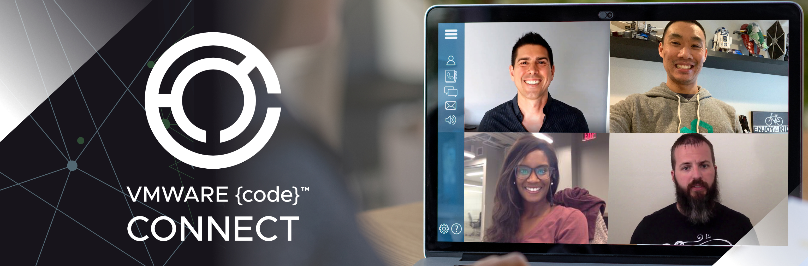
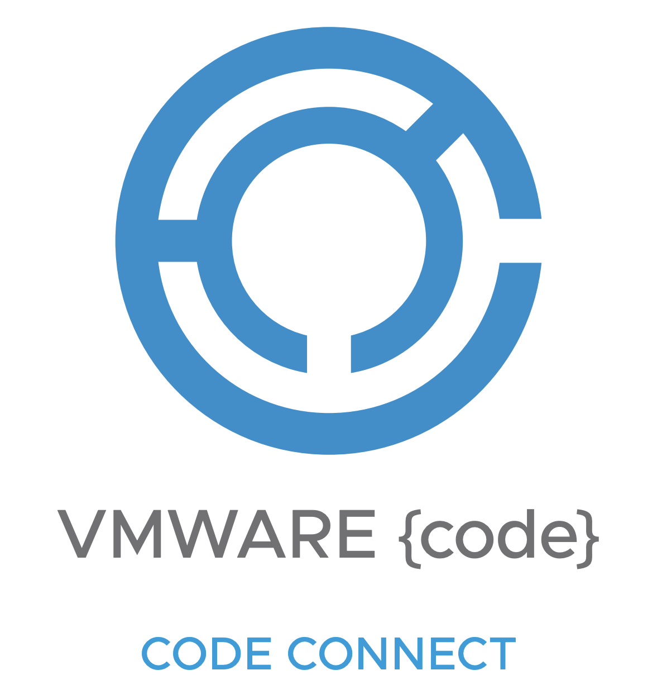

<!---->

<table>
   <tr>
     <td><a href="#day1" width="33%">Day 1 Sessions</a></td>
     <td><a href="#day2" width="33%">Day 2 Sessions</a></td>
     <td><a href="ScriptCompetition" width="33%">Script Competition</a></td>
     <td><a href="hackathon" width="33%">Hackathon</a></td>
  </tr>
  <tr>
    <td colspan="4" width="100%">Tracks: <a href="#tanzu">Tanzu</a>, <a href="#community">Community</a>, <a href="traditional">Traditional</a></td>
  </tr>
</table>

# Day 1 (10/1/20):

<h2 style="color:#B5E853;"><a href="Wayne">Octant - An open source platform for building Kubernetes UIs w/ Wayne Witzel</a></h2>
### **Time: 9:00-9:30AM PDT**

With so many different resources and custom resources within a Kubernetes cluster... <a href="Wayne">See More</a>
 

Zoom Link: <a href="vmware.zoom.us/jsdkfslf">vmware.zoom.us/jsdkfslf</a>

### **Automating Secrets with HashiCorp Vault and vRealize Automation w/ Sam McGowen**
### **Time: 10:00-10:30AM PDT**

Learn how to use HashiCorp Vault to manage secrets for your vRealize Automation environment. I will demonstrate how to leverage response wrapping, cubbyholes, approles and policies to ensure your secrets stay that way!

Zoom Link: <a href="vmware.zoom.us/jsdkfslf">vmware.zoom.us/jsdkfslf</a>

### **Monitoring K8s and TKGI in Modern Datacenter w/ Sajal Debnath**
### **Time: 10:30-11:00AM PDT**

With the ever-increasing use of containerized applications, we see a significant proliferation of related technologies in modern datacenters...<a href="Sajal">See More</a> 
Zoom Link: <a href="vmware.zoom.us/jsdkfslf">vmware.zoom.us/jsdkfslf</a>

### **Lets build a Kubernetes Operator in Go! w/ Michael Gasch**
### **Time: 11:00-12:30PM PDT**

Kubernetes is quickly becoming the standard cloud API for deploying and managing modern workloads. 
Fundamentally, end-users express their desired state (application) state which is then reconciled by individual controllers in the platform. The beauty of this approach, besides its simplicity and robustness, is that it can be extended and used beyond the core Kubernetes types. In fact, you can create your own APIs on top of Kubernetes for any resource by providing a custom controller logic to handle daily routine tasks or even complex lifecycle operations. This is also referred to as the "operator pattern". But how do you get started? What are the tools of the trade and basic primitives that you should understand before writing your first Kubernetes operator? Even if you are not a (Go) developer, in this session we will walk you through the steps of creating your first operator from scratch by explaining the fundamentals of the Kubernetes platform and applying our knowledge in a live coding session.

Zoom Link: <a href="vmware.zoom.us/jsdkfslf">vmware.zoom.us/jsdkfslf</a>

### **vSphere and VMware Cloud on AWS Automation Live Coding w/ William Lam**
### **Time: 1:30-3:00PM PDT**

Do you work with vSphere or VMware Cloud AWS and wish to automate a particular task that you have not been able to figure out? Maybe you are just getting started and looking for some tips or tools on how best to approach a specific problem? Perhaps you are already automating using either vSphere SOAP/REST API or VMware Cloud REST API but you are having issues looking for a specific API? If you have answered yes to any of these questions, this live coding session is for you. I will be using PowerShell/PowerCLI as a way to quickly prototype code during the session, so bring your question and let’s write some code together to help solve your automation tasks!

Zoom Link: <a href="vmware.zoom.us/jsdkfslf">vmware.zoom.us/jsdkfslf</a>

  

# Day 2 (10/2/20):

## Tanzu Track

### **Writing a Kubernetes Validating Admission Controller w/ Cora Iberkleid**

How do you control what goes into your Kubernetes cluster? How do you ensure that your users are following corporate guidelines for Kubernetes usage? How do you do all this without auditing the environment after the infraction occurred?This session by Cora Iberkleid will explore how to build a validating admission controller for use with a Kubernetes cluster. In this session, you’ll learn how to deploy a Python app that can validate Kubernetes API calls and either approve or deny them. You’ll learn how to setup a Kubernetes webhook and most importantly, you’ll learn why you might want to use an admission controller in your environment.

Zoom Link: vmware.zoom.us/jsdkfslf

### **Managing vSphere with Tanzu with a Custom PowerCLI Module w/ David Stamen**

Learn how to leverage VMware PowerCLI to build your own PowerShell module to manage your VMware vSphere with Tanzu environment.

Zoom Link: <a href="vmware.zoom.us/jsdkfslf">vmware.zoom.us/jsdkfslf</a>

## Traditional Track
### **Administration Modernization: Building and Deploying Containers to vSphere Integrated Containers w/ Justin Sider**

Join me as I teach you how to migrate your PowerCLI scripts to run in vSphere Integrated Containers (VIC). Administration Modernization will revolutionize your skillset and jumpstart your career as technology continues to evolve. During the session, I will demonstrate how to deploy a PowerShell/PowerCLI application to VIC. I will highlight some tips and tricks that I have learned in my own course of learning application modernization and how I apply those to PowerCLI."

Zoom Link: <a href="vmware.zoom.us/jsdkfslf">vmware.zoom.us/jsdkfslf</a>

### **PowerCLI and the Art of the API w/ Luc Dekens**

To up your PowerCLI game, you ultimately can't avoid getting into the APIs (SOAP and/or REST). While this might seem daunting at first, it really isn't that hard. With some very simple guidelines (and demos) this session will add APIs to your PowerCLI toolbelt.

Zoom Link: <a href="vmware.zoom.us/jsdkfslf">vmware.zoom.us/jsdkfslf</a>

### **Horizon Automation: From 101 to Deepdive w/ Wouter Kursten**

Virtual Session - Horizon Automation: From 101 to Deepdive will provide the attendees with the opportunity to learn how to get started with the VMware Horizon REST and SOAP API's to automate desktop and RDS pool CRUD (create/read/update/delete) operations and find out about the basic principles of the Horizon API and what it takes to get started with their automation project through the PowerCLI and Horizon module in a session full of Live demos. 

Zoom Link: <a href="vmware.zoom.us/jsdkfslf">vmware.zoom.us/jsdkfslf</a>

## Community Track

## Hackathon
