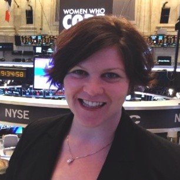
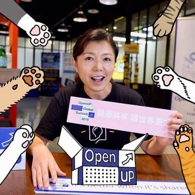

### **Women Who Code Panel**
### **Time: 2:30-3:00PM PDT**

Join Women Who Code, an international non-profit organization that provides services for women pursuing technology careers and a job board for companies seeking coding professionals. The company aims to provide an avenue into the technology world by evaluating and assisting women developing technical skills. They will be hosting a panel of three Sr. City Directors to discuss the efforts they've made in shaping the organization. 
 
  
<a title="Add to Calendar" class="addeventatc" data-id="Li5085556" href="https://www.addevent.com/event/Li5085556" target="_blank" rel="nofollow">Add to Calendar</a>
        

  

    

<b>Caterina Paun- Senior Instructor, Computer Science at Portland State University, Senior Director of WWCode Portland</b>  
Caterina Paun (she/her) is a developer, designer, speaker, and educator who is passionate about building communities. She currently works as a Senior Instructor in the Computer Science department at Portland State University, where she develops and reaches classes on web development and voice technologies. In the past, she has worked as a front end engineer and UX engineer for various companies, including PlexTV, Sears (digital), and Cisco. She is a Senior Director and co-founder of Women Who Code Portland; in that role, she has spent the last six years building both a community and a leadership team in Portland. She holds a masters from PSU and bachelor degrees in computer science and French from USC. In her free time, she enjoys reading, cooking, and traveling (though not so much these days).

 

    

<b>Joey Rosenberg- Chief Leadership Officer at Women Who Code</b>  
Joey Rosenberg serves as Chief Leadership Officer for Women Who Code, a global movement that has grown to become the world’s largest and most active community dedicated to inspiring women to excel in technology careers. Joey leads WWCode program, oversees local network operations for 70 volunteer-led cities in 20 countries, and is the visionary behind WWCode innovations like a borderless digital community, deep learning technical tracks, a new model for developing technical leaders, and the WWCode Fellowship program.   Joey’s professional background ranges from startup to Fortune 50 companies and includes roles in executive leadership, marketing, finance, and diversity and inclusion. Joey is an avid volunteer and has served as a World Board Member for the World Association of Girl Guides and Girl Scouts. Her passion for volunteerism and social impact drive her work daily, and has led her to engage in community empowerment projects across the globe.

 

    

<b>Jane Shih- Senior Director of WWCode Taipei</b> 
Jane is an entrepreneur focused on building a global community for tech professionals, especially for women in tech. She spent 6 years in Silicon Valley at eBay before moving to Taiwan and starting WeTogether.co, a hub for career development for women in tech so industry veterans and newbies to interact with each other, and grow, succeed together. She's currently also serving as the Sr Director of Women Who Code Taipei and Director of APAC, Ladies that UX. 

 
 
 
 
 
 

    

<b>Shwetha Lakshman Rao- Senior MTS at VMware, Senior Director of WWCode Bangalore</b> 
Shwetha has around 14 years of experience and holds a patent on High availability from US patent attorney. Being a tech enthusiast and an active innovator, she has researched and presented her papers in national / international conferences on technologies like IoT, Blockchain, Cloud and pursued PG Diploma in Machine Learning recently. She is one among the judging panel in Smart India Hackathon(one of the biggest hackathon in the world) organized by Govt of India and other hackathons. She is part of the core team driving different technical and D&I initiatives across VMware India. She participates in hackathons and have won 2 awards. She helps fellow members to ideate in number of hackathons and global Borathons. She hosts sessions for passionate engineers to brainstorm ideas addressing multiple technical problem statements. 
She has been awarded with VMware’s prestigious “EPIC2” award and several spot awards from VMware.  She has been awarded “#ApplaudHer 2019” from WomenWhoCode for her passion towards technology and empowering women   to grow in technical ladder. She has been invited as motivational speaker in different forums/conferences like Google’s WomenTechMakers , AWS Community day and so on. She is mentoring few women and helping them to grow in career. She is part of “VMInclusion Taara “  a highly impactful initiative from VMware in collaboration with WomenWhoCode which aims at upskill 15,000 women and help them return to work. "

 

