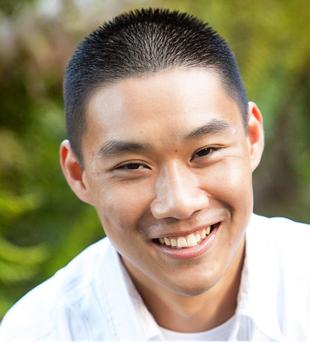

### **vSphere and VMware Cloud on AWS Automation Live Coding**
### **Time: 1:30PM-3PM PDT**

Do you work with vSphere or VMware Cloud AWS and wish to automate a particular task that you have not been able to figure out? Maybe you are just getting started and looking for some tips or tools on how best to approach a specific problem? Perhaps you are already automating using either vSphere SOAP/REST API or VMware Cloud REST API but you are having issues looking for a specific API? If you have answered yes to any of these questions, this live coding session is for you. I will be using PowerShell/PowerCLI as a way to quickly prototype code during the session, so bring your question and let’s write some code together to help solve your automation tasks!
 
 
<a title="Add to Calendar" class="addeventatc" data-id="Qv5085467" href="https://www.addevent.com/event/Qv5085467" target="_blank" rel="nofollow">Add to Calendar</a>
        

  

    

Meet our {code} coach William. William Lam is a Senior Staff Solution Architect working in the VMware Cloud team within the Cloud Platform Business Unit (CPBU) at VMware. He focuses on Automation, Integration and Operation of the VMware Software Defined Datacenter (SDDC). William also has his own website where he shares his knowledge https://www.virtuallyghetto.com/ On weekends, you can see William running Spartan races!

