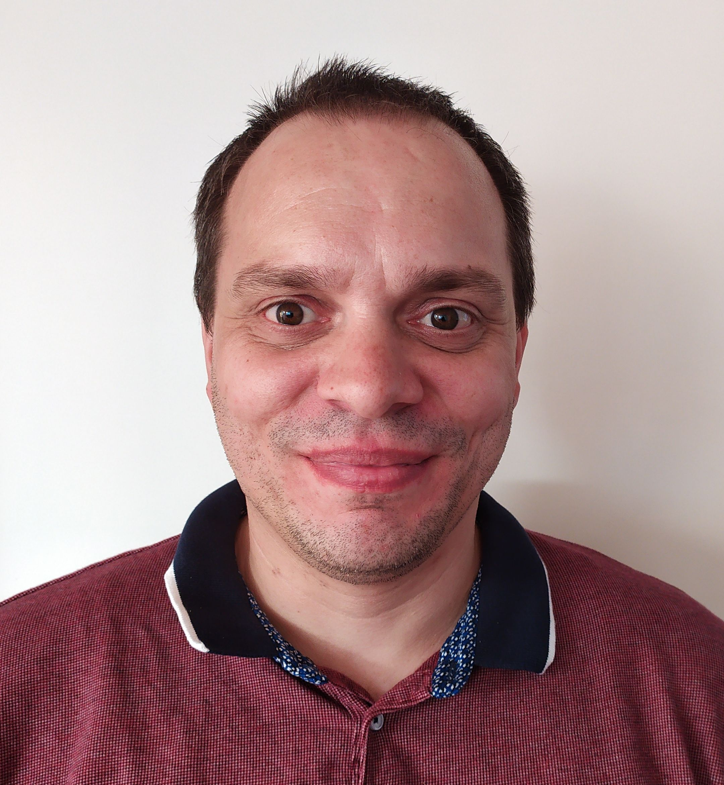

### **Horizon Automation: From 101 to Deepdive w/ Wouter Kursten**
### **Time: 10:30-11:00AM PDT**

Virtual Session - Horizon Automation: From 101 to Deepdive will provide the attendees with the opportunity to learn how to get started with the VMware Horizon REST and SOAP API's to automate desktop and RDS pool CRUD (create/read/update/delete) operations and find out about the basic principles of the Horizon API and what it takes to get started with their automation project through the PowerCLI and Horizon module in a session full of Live demos. 
 
  
  <a title="Add to Calendar" class="addeventatc" data-id="qp5085512" href="https://www.addevent.com/event/qp5085512" target="_blank" rel="nofollow">Add to Calendar</a>
        

  

    

Meet {code} coach Wouter! Wouter is the guru if it’s about the Horizon View Powershell API’s. He created the vCheck for Horizon View and added functions to the vmware.hv.helper module. You can find is work at https://github.com/Magneet or www.retouw.nl. During business hours he works for ControlUP as Professional Services Engineer. Wouter is  a WW1 nut that likes to go cycling in the Ypres area.

